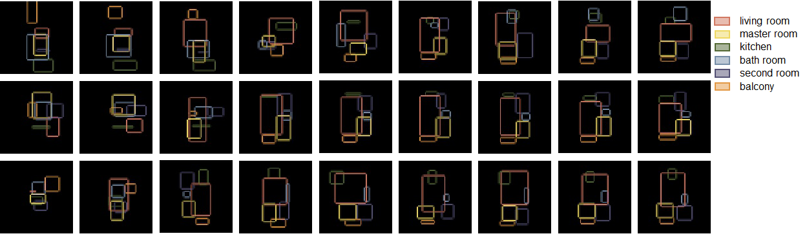

# FloorplanGAN  
 Ziniu Luo, Weixin Huang*  
*School of Architecture, Tsinghua University, Beijing, China*  
 
 Code and instruction for our Automation in Construction submission:**"FloorplanGAN: Vector Residential Floorplan Adversarial Generation"**  
### Introduction  
**FloorplanGAN** is a domain specific GAN combines Vector Generator and Raster Discriminator. It aims to synthesis vector residential floorplans based on *Differentiable Rendering*, *Adversiral Generation* and *Self-Attention*, etc.
### Dataset  
We leverage the open source dataset *RPlan* ([http://staff.ustc.edu.cn/~fuxm/projects/DeepLayout/index.html](http://staff.ustc.edu.cn/~fuxm/projects/DeepLayout/index.html)), which contains 80k+ well annotated real residential floorplans in PNG format. The training set, test set and validation set are divided 8:1:1.  
[Pyportace](https://pypi.org/project/pypotrace/) is used to vectorize these bitmap, and the preprocessed data can be download [here](https://cloud.tsinghua.edu.cn/df9310261ee5846998730/).
### Framework


### Installation

1.  dependency  
```
(base)$ conda create -n floorplangan python=3.8 -y
(base)$ conda activate floorplangan
(floorplangan)$ pip install -r requirement.txt
``` 
2.  path of dataset
```
ln -s path_to_preprocessed_data 
```
3.  configuration  
modify `config.yaml` to meet your hardwares.

### Training from scratch

1.  Train with single GPU
```
(floorplangan)$ python main.py
``` 
2. Or multi-GPUs (e.g. 4 GPUs)
```
(floorplangan)$ torchrun --nproc_per_node=4 main.py
```
2.  Visualize the training process  
``` 
(floorplangan)$ tesorboard --logidr=runs_rplan
``` 
### Testing with pretrained model
follow the instruction in [test.ipynb](FloorPlanGAN.ipynb)
### Evaluating with diverse metrics

Coming soon...
### Contribution
1. luozn15@qq.com (Z. Luo)
2. wxhuang@mail.tsinghua.edu.cn (W. Huang)
### Acknowledgement
This work is supported by the grant No.51778315 of National Science Foundation of China.We would like to thank licensed architects and master students of architecture for participating in our user study.
